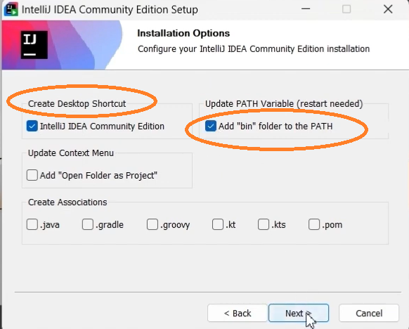
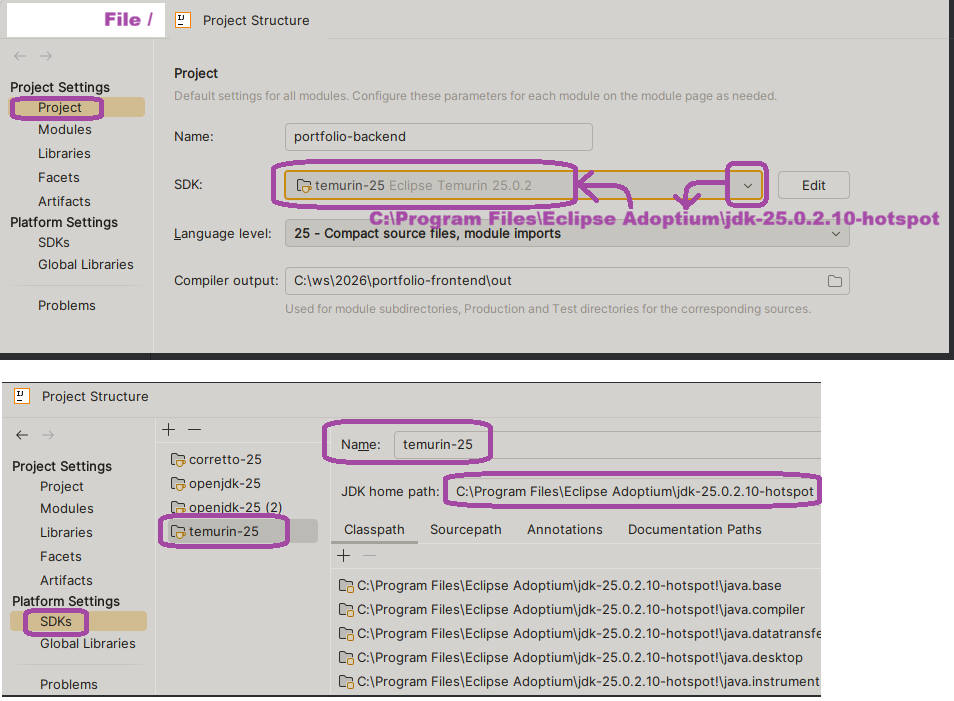
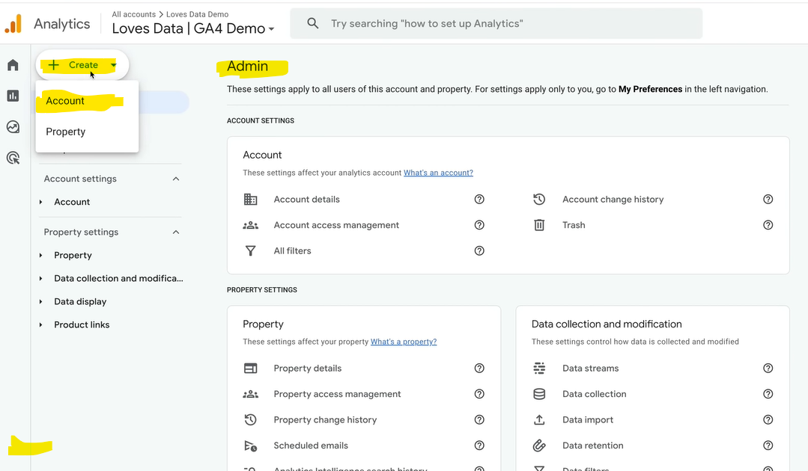
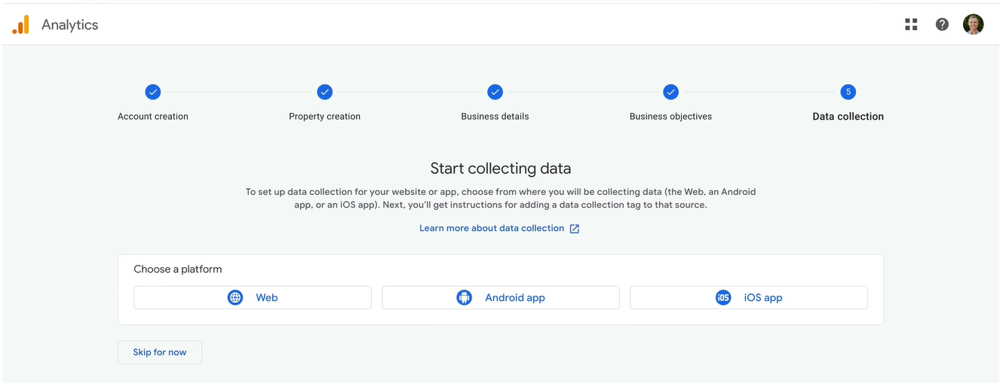
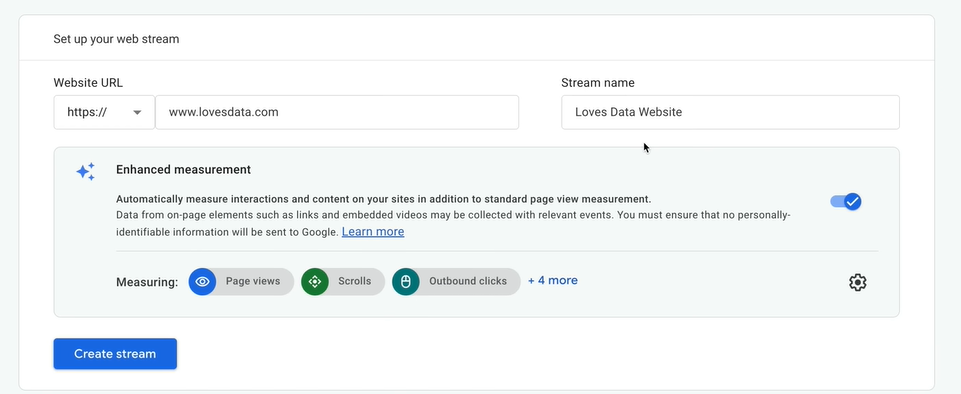
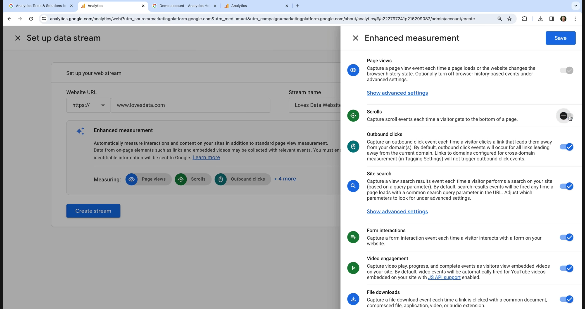
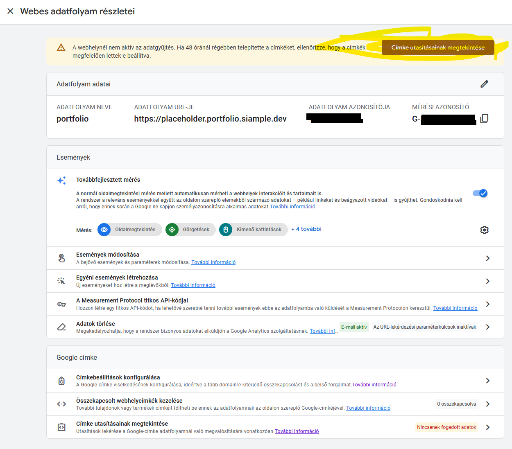
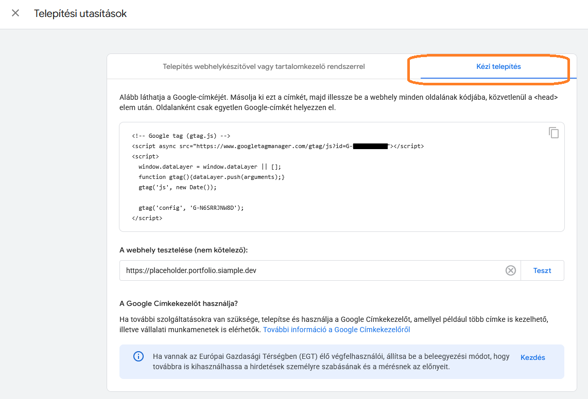

# Departure Checklist
* [ x ]  1. Java EE JDK TLS 21
   * https://adoptium.net/temurin/releases/?version=8&os=any&arch=any 
   * JDK TLS 21 OpenJDK 64-Bit Server VM Temurin-21.0.10+7
   * OpenJDK21U-jdk_x64_windows_hotspot_21.0.10_7.msi
   * PATH+ %JAVA_HOME%\bin 
   * Restart the computer! Important!
   * ```java -version```
    

* [ x ] 2. Maven 3.9< 
   * https://maven.apache.org/download.cgi#Binary Binary zip archive link
   * Unzip apache-maven-3.9.12-bin.zip
   * into c:\Program Files\Maven\apache-maven-3.9.12 
   * PATH+ %MAVEN_HOME%\bin and move it up on the 1st top place! 
   * Restart the computer! Important!
   * ```mvn -v```


* [ x ] 3. IntelliJ IDEA Community edition 
   * https://www.jetbrains.com.cn/en-us/idea/download/other/
   * idealC-2025.2.6.1.exe


* [ x ] 4. File/New Project portfolio-backend
    * Name: portfolio-backend
    * java 
    * Maven (BUTTON) 
    * JDK: temurin-21 Temurin Eclipse 21.0.10 
    * Yes=Add sample code


* [ x ] 5. Always check whether your project uses the intended java!
    * File / Project Structure / Project Settings / Project / SDK: 
      * temurin-21 Temurin Eclipse 21.0.10
    * File / Project Structure / Platform Settings / SDKs:
      * temurin-21
      * C:\Program Files\Eclipse Adoptium\jdk-21.0.10.7-hotspot

  
* [ x ] 6. Complete your POM.XML based on a similar created project via https://start.spring.io/index.html
    * The stable spring boot version is 3.4.2
    * and Spring Boot 3.4.2 requires minimum Java 17.
    * ```<parent> . . . <version>3.4.2</version> . . . </parent>```
    * Spring boot do use java 21, UTF-8 source encoding
  ```XML
      <properties>
        <java.version>21</java.version>
        <maven.compiler.source>${java.version}</maven.compiler.source>
        <maven.compiler.target>${java.version}</maven.compiler.target>
        <project.build.sourceEncoding>UTF-8</project.build.sourceEncoding>
      </properties>
     ```
    * POM.XML need end with spring-boot additional related plugin.
  ```XML
      <build>
        <plugins>
            <plugin>
                <groupId>org.apache.maven.plugins</groupId>
                <artifactId>maven-compiler-plugin</artifactId>
            </plugin>
        </plugins>
        </build>
      </project>
     ```

* [ x ] 6. Complete your POM.XML with dependencies
  ```XML
   <dependencies>
        <!-- Web MVC -->
        <dependency>
            <groupId>org.springframework.boot</groupId>
            <artifactId>spring-boot-starter-web</artifactId>
        </dependency>
         <!-- need  -->
        <dependency>
            <groupId>org.springframework.boot</groupId>
            <artifactId>spring-boot-starter-thymeleaf</artifactId>
        </dependency>
        <!-- Optional but recommended -->
        <dependency>
            <groupId>org.springframework.boot</groupId>
            <artifactId>spring-boot-devtools</artifactId>
            <scope>runtime</scope>
        </dependency>
        <!--STOMP over websocket includes the earlier spring-websocket, spring-messaging dependencies-->
        <dependency>
            <groupId>org.springframework.boot</groupId>
            <artifactId>spring-boot-starter-websocket</artifactId>
        </dependency>
        <!-- Lombok 1.18.30+ supports Java 21, and Lombok 1.18.32 is stable, safe -->
        <dependency>
            <groupId>org.projectlombok</groupId>
            <artifactId>lombok</artifactId>
            <version>1.18.32</version>
            <scope>provided</scope>
        </dependency>
     </dependencies>
     ```


## 1; Download & Install java

* Java JRE < SE < EE (developers need Java EE) 
  * Java SE (Standard Edition) is a software development platform that includes the Java Development Kit (JDK) 
    and the Java Runtime Environment (JRE), while the JRE is specifically the environment required to run Java applications. 
    In simple terms, Java SE is for developers to create applications, and JRE is for users to run those applications. 
    Java SE (Standard Edition) is the core platform for developing and running Java applications, while Java EE 
    (Enterprise Edition) builds on Java SE to provide additional features for large-scale, multi-tiered applications. 
    The JRE (Java Runtime Environment) is a subset of Java SE that allows users to run Java applications but 
    does not include development tools.

* [  ] Download & Install Temurin LTS jdk download 8, 11, 17, 21, 25
  * https://adoptium.net/temurin/releases/?version=8&os=any&arch=any
  * OpenJDK25U-jdk_x64_windows_hotspot_25.0.2_10.msi

* [  ] Set Path variable on Windows 11
  * W + R --> sysdm.cpl --> System Properties --> Advanced --> Environment Variables
  * Search symbol next to the start symbol --> type Environment --> Edit The System Environment Variables
    * System variables section:
      * JAVA_HOME : C:\Program Files\Eclipse Adoptium\jdk-25.0.2.10-hotspot
      * PATH+ %JAVA_HOME%\bin and move it up on the 1st top place!
      * Restart the computer! Important!
* [  ] Check: java -version

    ```bash
    PS C:\ws\...anywhere...> java -version
    openjdk version "25.0.2" 2026-01-20 LTS
    OpenJDK Runtime Environment Temurin-25.0.2+10 (build 25.0.2+10-LTS)
    OpenJDK 64-Bit Server VM Temurin-25.0.2+10 (build 25.0.2+10-LTS, mixed mode, sharing)
    ```

## 2/1; Download IDE

* Intellij IDEA Community edition download free
* https://www.jetbrains.com.cn/en-us/idea/download/other/

* 

* The downloaded filename schould contain the "C" letter: idealC-2025.2.6.1.exe


## 2/2; Install IDE
* 

## 2/3; Check java jdk used by the IDE
* 


# 3; File/New Project portfolio-backend
* portfolio-backend, Maven, temurin-21 Temurin Eclipse 21.0.10, Yes=Add sample code

## 3/1; pom.xml
* Change Spring Boot parent version from 4.0.2 (invalid) to 3.4.2 (stable).
* 
```xml
<parent>
    <groupId>org.springframework.boot</groupId>
    <artifactId>spring-boot-starter-parent</artifactId>
    <version>3.4.2</version>
    <relativePath/> <!-- lookup parent from repository -->
</parent>
```

## 3/2; TransformMain.java into a proper Spring Boot entry point
* by adding @SpringBootApplication, etc.
  * That was as a pure java entry point:
    ```java
       public class Main {
           public static void main(String[] args) {
               System.out.println("Hello World!");
           }
       }
    ```

  * That is the Spring Boot entry point, after the transformation:
    ```java
       package dev.siample;

       import org.springframework.boot.SpringApplication;
       import org.springframework.boot.autoconfigure.SpringBootApplication;

       @SpringBootApplication
       public class Main {
           public static void main(String[] args) {
               SpringApplication.run(Main.class, args);
          }
      }
    ```

## 3/3; Need Maven 3.9< mvnw.cmd and mvnw
* Download Maven from https://maven.apache.org homepage 
  * https://maven.apache.org/download.cgi 
  * https://maven.apache.org/download.cgi#CurrentMaven
  * https://maven.apache.org/download.cgi#Binary  Binary zip archive Link: 
* Unzip the downloaded **apache-maven-3.9.12.zip** file to a directory (C:\, C:\Program Files\Maven\, C:\tools\maven\).
  * c:\Program Files\Maven\apache-maven-3.9.12
* system's PATH environment variable System variables section:
    * MAVEN_HOME : C:\Program Files\Maven\apache-maven-3.9.12
    * PATH+ %MAVEN_HOME%\bin and move it up on the 1st top place!
    * Restart the computer! Important!
* Verify the installation by running **mvn -v** in the terminal.  

## 3/4; Error
  * The current build fails with java.lang.ExceptionInInitializerError because the Lombok version (1.18.36) 
    is not compatible with the internal changes in JDK 25 (TypeTag :: UNKNOWN). 
  * So i need to update the Lombok version to 1.18.20.0, and step back onto the previous LTS java version 21.0.10.7. 
  * That is a plugin, not the Lombok dependency. And version 1.18.20.0 is too old for Java 21. 
  * Java 21 changed internal compiler APIs (TypeTag.UNKNOWN), and old Lombok versions break with exactly this error.
   * Lombok 1.18.30+ supports Java 21
     👉 1.18.32 is safe
   * 

```xml
    <parent>
        <groupId>org.springframework.boot</groupId>
        <artifactId>spring-boot-starter-parent</artifactId>
        <version>3.4.2</version>
        <relativePath/> <!-- lookup parent from repository -->
    </parent>
```
```xml
    <properties>
        <java.version>21</java.version>
        <maven.compiler.source>${java.version}</maven.compiler.source>
        <maven.compiler.target>${java.version}</maven.compiler.target>
        <project.build.sourceEncoding>UTF-8</project.build.sourceEncoding>
    </properties>
```
  ```bash
     java: java.lang.ExceptionInInitializerError
     com.sun.tools.javac.code.TypeTag :: UNKNOWN
  ```

* maven repository central https://mvnrepository.com/repos/central
* 

  ```xml
     <!-- Source: https://mvnrepository.com/artifact/org.projectlombok/lombok-maven-plugin -->
    <dependency>
        <groupId>org.projectlombok</groupId>
        <artifactId>lombok-maven-plugin</artifactId>
        <version>1.18.20.0</version>
        <scope>compile</scope>
    </dependency>
  ```

# 4; The goal is java 21 TLS, and Maven 3.9.12
  ```bash
     java -version
     openjdk version "21.0.10" 2026-01-20 LTS
     OpenJDK Runtime Environment Temurin-21.0.10+7 (build 21.0.10+7-LTS)
     OpenJDK 64-Bit Server VM Temurin-21.0.10+7 (build 21.0.10+7-LTS, mixed mode, sharing)

     mvn -v
     Apache Maven 3.9.12 (848fbb4bf2d427b72bdb2471c22fced7ebd9a7a1)
     Maven home: C:\Program Files\Maven\apache-maven-3.9.12
     Java version: 21.0.10, vendor: Eclipse Adoptium, runtime: C:\Program Files\Eclipse Adoptium\jdk-21.0.10.7-hotspot
     Default locale: hu_HU, platform encoding: UTF-8
    OS name: "windows 11", version: "10.0", arch: "amd64", family: "windows"
  ```
* mvn clean compile or .\mvnw clean compile if there is Maven wrapper
* mvn spring-boot:run or .\mvnw spring-boot:run if there is Maven wrapper


# 6; FINAL TECH GOALs

* LTS JAVA JDK 21, PATH variable, 
* Stable spring boot parent version<version>3.4.2</version>
* Maven 3.9.12, PATH variable at at first place!
* in terminal after commad of "mvn spring-boot:run"this command should return the index.html page:
  *  curl http://localhost:8080/ 


```xml
    <properties>
        <java.version>21</java.version>
        <maven.compiler.source>${java.version}</maven.compiler.source>
        <maven.compiler.target>${java.version}</maven.compiler.target>
        <project.build.sourceEncoding>UTF-8</project.build.sourceEncoding>
    </properties>
```


### Git issues
* [ ] making the remote empty repo on https://github.com/
  * new repository: portfolio-backend
* [ ] github.com/AgnesVelemi/portfolio-backend
* [ ] Git-2.52.0-64-bi.exe do install! You will have GitBash.

```bash
git init
git branch -M main
git add README.md
git add --all
git commit -m "ws/stomp app/greet topic/greetings, /api/cv/{lang} pdf open"

git config --global user.email "a.k@gmail.com"
git config --global user.name "AgnesVelemi"

git remote add origin https://github.com/AgnesVelemi/portfolio-backend.git
git push -u origin main
```

* [ ] or push an existing repository from the command line
```bash
git remote add origin https://github.com/un/portfolio-frontend.git
git branch -M main
git push -u origin main
```


# Continue...


# GA4 https://www.youtube.com/watch?v=pRKpaZJJRxk

## 1; Create a google analytics Account
- with your preferred gmail.com emailaddress like a.g@gmail.com
- agnes.kommunikation@gmail.com
- https://analytics.google.com/analytics/web/#/a382240857p521880981/reports/start?params=_u..nav%3Dmaui
- OR IF I'VE an GA account then:
  - log in, and create a new GA4 property

- Google Marketing Platform site is:
  - https://marketingplatform.google.com/about/
  - here y can sign up for GA = Google Analytics
  
    - a.) Get started today
    - b.) Sign in to Analytics: you can select one of your google account

    - 
    
    - https://www.youtube.com/watch?v=pRKpaZJJRxk
    - /For Small Businesses / Analytics
    - Admin / +Create / Account (not Property)
    - 
    - AccountName (top level folder): My Portfolio
      - for your each other GA-need-business you can create a new account
    - and here you can check how your data is shared: at first y can uncheck them, 
      later check if u need to Grant Google Technical Support access your data.
    - Next
    - Create a property, which is used to report on an individual website but you can collect data
      from multiple websites and apps into a single property. So everything is combined in one set of reports.
      Propertyname =Tulajdon neve: can be reflects the website app or combination of websites and app you will be measuring.
    - Property name = Portfolio website
    - TimeZone Budapest CET (UTC+1) Hungary (GMT+01:00)
    - Next
    - Small Business
    - Next
    - Get Baseline reports (a prepared report)
    - Create (Hungary, I accept the terms)
    - Create one-one DataStream=Adatfolyam for each Web, Android, Ios to collect 
    - data towards to reports to process that data, from the measurment places (Web, A, Ios).


- 

  - URL https://www.lovesdata.com
  - Stream name: Loves Data Website
- 

- Enhanced measurement settings (by default turned on):
  - GA4 automatically tracks these actions:
    - page views, and 
    - people scrolling pages on my website,
    - clicks on outbound link my website
    - search functions forms
    - people watching embedded YouTube videos
    - and people downloading files
  - But you can turn it off, or clicing on the figuration icon settings ena/disabling the actions.
- Save --> Create Stream.


- 
Installation instructions = Címke utasításainak megtekintése


- 


- 

