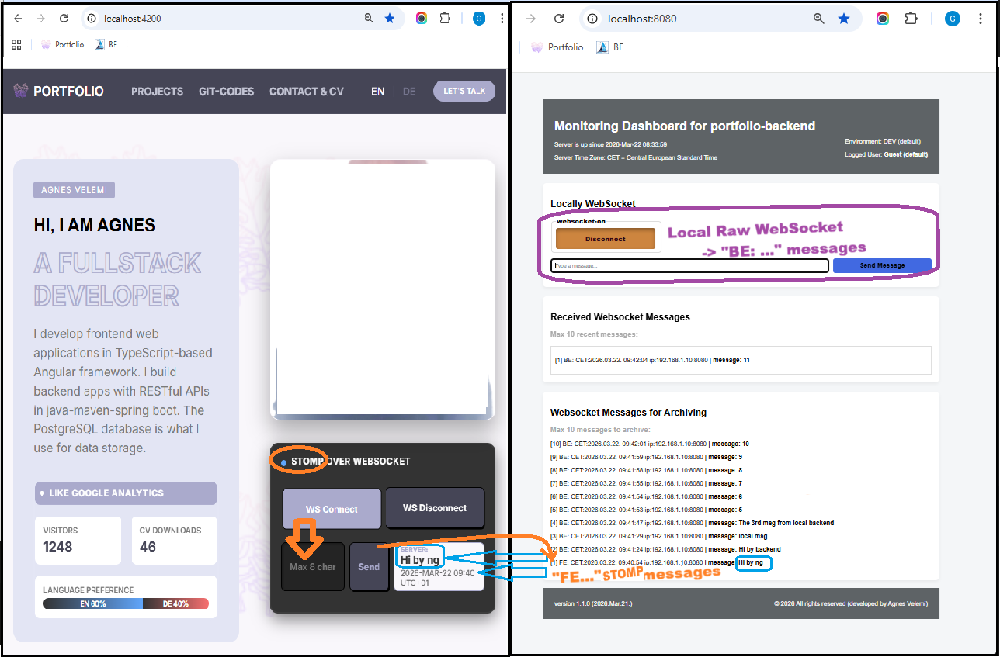

# Full-Stack Portfolio Backend - Spring Boot & WebSocket

Welcome to the backend project of my professional portfolio. This application serves as the core logic and data provider for my full-stack portfolio system, built with a focus on real-time communication via raw data websocket, and STOMP over websocket.

## 🔗 Portfolio Ecosystem

This project is the backend part of a larger full-stack application. You can explore the complementary frontend project here:

- **Frontend Repository**: [Portfolio Frontend (Angular)](https://github.com/AgnesVelemi/portfolio-frontend.git)
- **Backend Repository**: [Portfolio Backend (Spring Boot)](https://github.com/AgnesVelemi/portfolio-backend.git)

The backend is currently configured to communicate with the Angular frontend running on `http://localhost:4200`.

## 🚀 Key Features

- **Real-time Communication**: Dual WebSocket architecture utilizing both raw Data WebSockets and STOMP over WebSockets for multifaceted data synchronization.
- **MVC & RESTful Integration**:
    - **@Controller Architecture**: The `DashboardController` manages the central dashboard via Spring MVC, injecting initial server-side data (Environment, TimeZone, Server Uptime) into the `Model` for **Thymeleaf** rendering.
    - **Clean API Endpoints**: Documented endpoints for CV data retrieval and session-based message handling.
- **Dynamic Frontend**: The dashboard UI is pre-rendered with Thymeleaf and dynamically updated through integrated `dashboard.js` logic.

## 📡 WebSocket Architecture

The system implements a sophisticated dual-channel communication strategy:

1.  **Local Raw WebSocket (`/ws/dashboard`)**:
    - Dedicated for local data synchronization and internal status monitoring.
    - Handles raw data transmission directly within the backend ecosystem.
2.  **External STOMP WebSocket (`/ws/stomp`)**:
    - Primary integration point for the **Portfolio Frontend**.
    - **Security/Routing**: Uses custom `connectHeaders` (e.g., `client-type: frontend`).
    - **Protocol Flow**: Accepts data via `/app/*` destinations and broadcasts real-time updates through `@SendTo("/topic/messages")`, including automated server-side timestamps.

## 🛠️ Technology Stack

- **Backend Framework**: Spring Boot 3.4.2
- **Language**: Java 21 (LTS)
- **Messaging Protocol**: STOMP / WebSocket
- **Build Tool**: Maven 3.9+
- **Template Engine**: Thymeleaf (for server-side rendering where applicable)
- **Utilities**: Lombok (for boilerplate reduction)

## ⚙️ Quick Start

For detailed instructions on how to set up this backend on your local machine, please refer to the:

👉 **[Live Installation Guide](DOC/md/install_for_backend_live.md)**

## 🌍 Multilingual Documentation

- 🇩🇪 **[README in German / German Version](README_live_DE.md)**

---
*Developed by Agnes Velemi - Passionate Full-Stack Developer*
